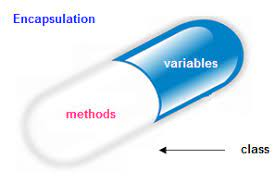

## Lecture-27 Introduction to OOPs

### OOPs : 

OOP stands for Object-Oriented Programming.Its aims to implement real-life entities like inheritance, data-hiding, polymorphism, etc in programming.

Software Development standards

### Pillars of OOPs

* Encapsulation 
* Abstraction  
* Polymorphism
* Inheritance.

**Encapsulation :** Putting related data & function at one place.


<br>

**Abstraction :** Abstraction displays only necessary information and hiding details information about how it is implemented.

<br>

**Polymorphism :** Polymorphism as the ability of a message to be displayed in more than one form.

Poly - many & morphism - forms

cal_area(l,b) cal_area(s) cal_area(r)

<br>

**Inheritance :** Inheritance is a mechanism of reusing and extending existing classes without modifying them. 
```cpp
    
        criteria
         
     -----[RBI]-----
     |      |      |
   [SBI]  [BOI]  [HDFC]

```
```cpp

    ------[Google Login]------
    |           |            |
  [RTC]     [Twitter]      [xyz]

```

Class & Objects

Class : Class is a blueprint to structure data of any entity.
 
```cpp
Planning ==> Entity
Class ==> object

```

Class

```cpp
data members ==> variable -> to store data

access specifiers ==> permission  

methods ==> functions 
```

## 🏠  HomeWork
1️⃣ 

## 🔗 Some Useful Links

## 📖 References